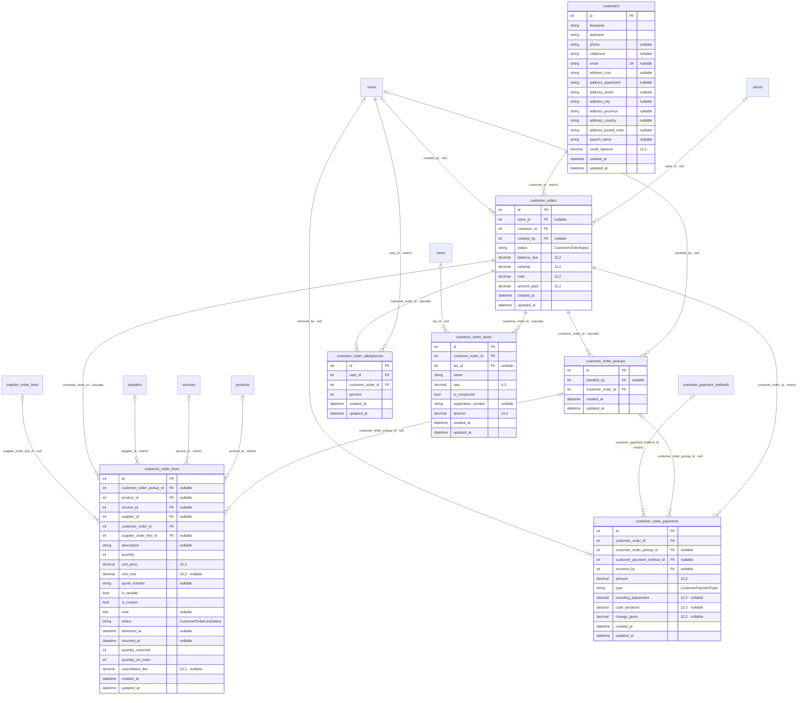
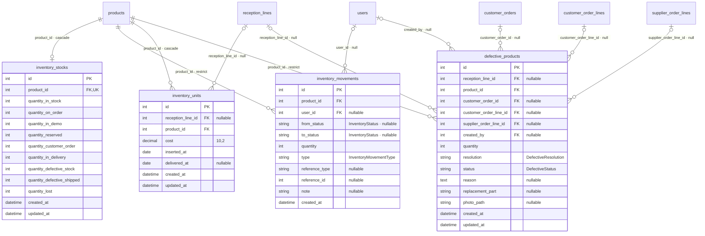
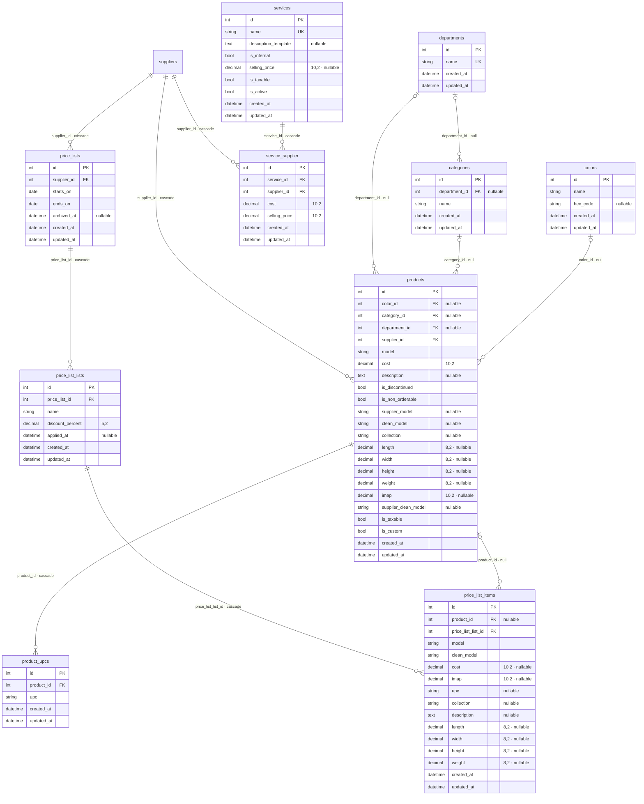
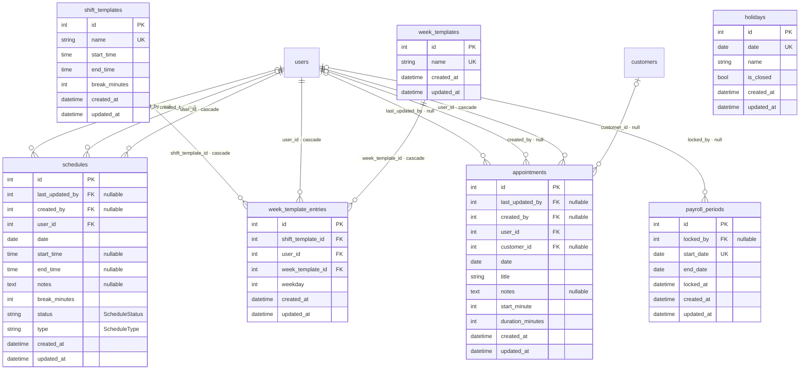
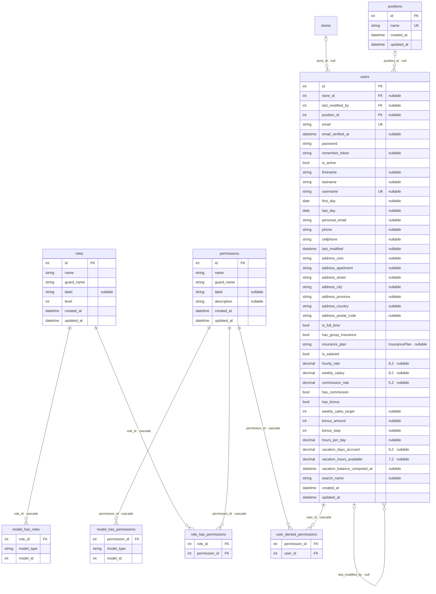
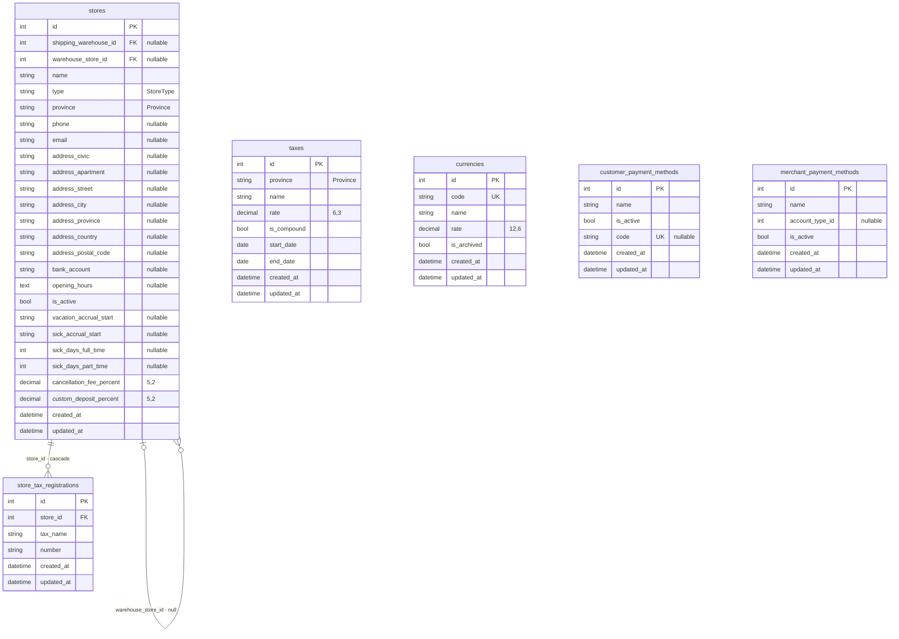

# Modèle de données

Schéma de la base au 2026-10-10 (141 migrations, 49 tables métier). La source exacte du schéma est
le dump SQL [`database/schema/sqlite-schema.sql`](../database/schema/sqlite-schema.sql), à jour avec
les 141 migrations. Les conventions (montants, statuts, règles de suppression, données de référence)
sont expliquées dans l'[ADR 0006](adr/0006-database.md).

## Comment lire les diagrammes

- **Une boîte vide** est une table d'un autre domaine : elle est détaillée dans sa propre section.
- **Clés :** `PK` clé primaire, `FK` clé étrangère, `UK` valeur unique.
- **Notes entre guillemets :** précision d'un décimal (`12,2`), enum PHP casté dans le modèle
  (`CustomerOrderStatus`), `nullable`.
- **Types :** `int`, `string`, `decimal`, `bool`, `text`, `date`, `datetime`, `time`.
- **Cardinalités :**

  | Symbole | Sens |
  |---|---|
  | `\|\|--o{` | Le parent est obligatoire, il a zéro ou plusieurs enfants |
  | `\|o--o{` | Le parent est optionnel (clé étrangère `nullable`) |
  | `\|\|--o\|` | Un pour un (clé étrangère unique) |

- **Étiquette d'une relation :** colonne de la clé étrangère · règle de suppression du parent
  (`restrict` : suppression refusée, `cascade` : enfants supprimés aussi, `null` : la clé devient vide).

## Sommaire

- [Vue d'ensemble](#vue-densemble)
- [Clients et ventes](#clients-et-ventes)
- [Fournisseurs, réceptions et factures](#fournisseurs-réceptions-et-factures)
- [Inventaire](#inventaire)
- [Catalogue, services et listes de prix](#catalogue-services-et-listes-de-prix)
- [Horaires, rendez-vous et paie](#horaires-rendez-vous-et-paie)
- [Usagers et accès](#usagers-et-accès)
- [Magasins, taxes et paramètres](#magasins-taxes-et-paramètres)
- [Tables techniques de Laravel](#tables-techniques-de-laravel)

## Vue d'ensemble

Relations entre les domaines, sans les colonnes. Les usagers et les tables d'accès sont retirés pour
la lisibilité : presque toutes les tables y sont reliées (`created_by`, `user_id`…).

```mermaid
erDiagram
    stores |o--o{ customer_orders : ""
    customers ||--o{ customer_orders : ""
    customer_order_pickups |o--o{ customer_order_lines : ""
    products |o--o{ customer_order_lines : ""
    services |o--o{ customer_order_lines : ""
    suppliers |o--o{ customer_order_lines : ""
    customer_orders ||--o{ customer_order_lines : ""
    supplier_order_lines |o--o{ customer_order_lines : ""
    customer_orders ||--o{ customer_order_payments : ""
    customer_order_pickups |o--o{ customer_order_payments : ""
    customer_payment_methods |o--o{ customer_order_payments : ""
    customer_orders ||--o{ customer_order_pickups : ""
    customer_orders ||--o{ customer_order_salesperson : ""
    customer_orders ||--o{ customer_order_taxes : ""
    taxes |o--o{ customer_order_taxes : ""
    stores ||--o{ store_tax_registrations : ""
    currencies |o--o{ suppliers : ""
    suppliers |o--o{ supplier_orders : ""
    suppliers ||--o{ supplier_orders : ""
    supplier_orders ||--o{ supplier_order_lines : ""
    products |o--o{ supplier_order_lines : ""
    suppliers ||--o{ receptions : ""
    receptions ||--o{ reception_lines : ""
    supplier_order_lines ||--o{ reception_lines : ""
    products |o--o{ reception_lines : ""
    supplier_orders |o--o| supplier_invoices : ""
    suppliers ||--o{ supplier_invoices : ""
    receptions |o--o| supplier_invoices : ""
    supplier_order_lines |o--o{ supplier_invoice_lines : ""
    supplier_invoices ||--o{ supplier_invoice_lines : ""
    reception_lines |o--o{ supplier_invoice_lines : ""
    products ||--o| inventory_stocks : ""
    products ||--o{ inventory_movements : ""
    reception_lines |o--o{ inventory_units : ""
    products ||--o{ inventory_units : ""
    reception_lines |o--o{ defective_products : ""
    products ||--o{ defective_products : ""
    customer_orders |o--o{ defective_products : ""
    customer_order_lines |o--o{ defective_products : ""
    supplier_order_lines |o--o{ defective_products : ""
    colors |o--o{ products : ""
    categories |o--o{ products : ""
    departments |o--o{ products : ""
    suppliers ||--o{ products : ""
    services ||--o{ service_supplier : ""
    suppliers ||--o{ service_supplier : ""
    products ||--o{ product_upcs : ""
    departments |o--o{ categories : ""
    suppliers ||--o{ price_lists : ""
    price_lists ||--o{ price_list_lists : ""
    products |o--o{ price_list_items : ""
    price_list_lists ||--o{ price_list_items : ""
    shift_templates ||--o{ week_template_entries : ""
    week_templates ||--o{ week_template_entries : ""
    customers |o--o{ appointments : ""
```

## Clients et ventes

- Une commande appartient à un client (`restrict`) et à un magasin, dont elle applique la politique
  (frais d'annulation).
- Les lignes, les ramassages et les vendeurs suivent la commande (`cascade`), mais les paiements
  empêchent sa suppression (`restrict`).
- Une ligne client est liée à la ligne fournisseur qui la comble (`supplier_order_line_id`) et au
  ramassage qui l'a remise au client (`customer_order_pickup_id`).
- Une ligne vend **soit** un produit (`product_id`), **soit** un service (`service_id`, avec le
  fournisseur qui le rend dans `supplier_id`, vide pour un service interne, et la `description` précise
  de la vente). Les deux clés sont `nullable`.
- Un article **sur mesure** (`is_custom`) vend un produit gabarit avec ses spécifications
  (`description`), le coût soumis par le fournisseur (`unit_cost`) et son numéro de soumission
  (`quote_number`); il est toujours commandé, jamais pris en stock.
- `unit_price`, `cancellation_fee` et `is_taxable` sont figés sur la ligne au moment de la vente
  ([ADR 0004](adr/0004-cancellation-fee.md)).
- `customer_order_taxes` : taxes copiées sur la commande à sa création (nom, taux, cascade, numéro
  d'inscription du magasin) avec leur montant courant, calculé sur les lignes taxables et les frais
  d'annulation seulement.

## Fournisseurs, réceptions et factures

- Une facture couvre **soit** une réception (produits), **soit** une commande de services : les deux
  clés sont uniques et `nullable`.
- `supplier_order_lines.substituted_from_line_id` relie une ligne à celle qu'elle remplace
  (substitution par le fournisseur).
- Les documents se protègent en chaîne (`restrict`) : ligne de commande ← ligne de réception ← ligne
  de facture.

```mermaid
erDiagram
    suppliers |o--o{ suppliers : "default_shipping_supplier_id · null"
    currencies |o--o{ suppliers : "currency_id · null"
    suppliers |o--o{ supplier_orders : "shipping_supplier_id · null"
    suppliers ||--o{ supplier_orders : "supplier_id · restrict"
    users |o--o{ supplier_orders : "created_by · null"
    supplier_order_lines |o--o{ supplier_order_lines : "substituted_from_line_id · null"
    supplier_orders ||--o{ supplier_order_lines : "supplier_order_id · cascade"
    products |o--o{ supplier_order_lines : "product_id · null"
    users |o--o{ receptions : "received_by · null"
    suppliers ||--o{ receptions : "supplier_id · restrict"
    users |o--o{ reception_lines : "reversed_by · null"
    receptions ||--o{ reception_lines : "reception_id · cascade"
    supplier_order_lines ||--o{ reception_lines : "supplier_order_line_id · restrict"
    products |o--o{ reception_lines : "product_id · null"
    supplier_orders |o--o| supplier_invoices : "supplier_order_id · restrict"
    suppliers ||--o{ supplier_invoices : "supplier_id · restrict"
    receptions |o--o| supplier_invoices : "reception_id · restrict"
    users |o--o{ supplier_invoices : "created_by · null"
    supplier_order_lines |o--o{ supplier_invoice_lines : "supplier_order_line_id · restrict"
    supplier_invoices ||--o{ supplier_invoice_lines : "supplier_invoice_id · cascade"
    reception_lines |o--o{ supplier_invoice_lines : "reception_line_id · restrict"
    suppliers {
        int id PK
        int default_shipping_supplier_id FK "nullable"
        int currency_id FK "nullable"
        string type "SupplierType"
        string name
        string phone "nullable"
        string email "nullable"
        string account_number "nullable"
        string bank_account "nullable"
        string order_email "nullable"
        bool orderable
        bool is_active
        decimal price_multiplier "8,4"
        string address_civic "nullable"
        string address_apartment "nullable"
        string address_street "nullable"
        string address_city "nullable"
        string address_province "nullable"
        string address_country "nullable"
        string address_postal_code "nullable"
        string payment_address_civic "nullable"
        string payment_address_apartment "nullable"
        string payment_address_street "nullable"
        string payment_address_city "nullable"
        string payment_address_province "nullable"
        string payment_address_country "nullable"
        string payment_address_postal_code "nullable"
        decimal base_multiplier "8,4"
        decimal customs_fee "8,4"
        decimal shipping_fee "8,4"
        decimal prepaid_amount "10,2 · nullable"
        bool collect
        decimal early_payment_discount_percent "5,2"
        int early_payment_discount_days "nullable"
        bool early_payment_next_month
        datetime created_at
        datetime updated_at
    }
    supplier_orders {
        int id PK
        int shipping_supplier_id FK "nullable"
        int supplier_id FK
        int created_by FK "nullable"
        string number UK "nullable"
        string type "SupplierType"
        string status "SupplierOrderStatus"
        text notes "nullable"
        datetime sent_at "nullable"
        datetime received_at "nullable"
        bool is_collect
        string quote_number "nullable"
        datetime last_emailed_at "nullable"
        bool is_drop_ship
        string drop_ship_name "nullable"
        string drop_ship_address_civic "nullable"
        string drop_ship_address_apartment "nullable"
        string drop_ship_address_street "nullable"
        string drop_ship_address_city "nullable"
        string drop_ship_address_province "nullable"
        string drop_ship_address_country "nullable"
        string drop_ship_address_postal_code "nullable"
        datetime created_at
        datetime updated_at
    }
    supplier_order_lines {
        int id PK
        int substituted_from_line_id FK "nullable"
        int supplier_order_id FK
        int product_id FK "nullable"
        string description "nullable"
        int quantity
        decimal unit_cost "10,2"
        int quantity_received
        string status "SupplierOrderLineStatus"
        string cancellation_reason "nullable"
        datetime cancellation_requested_at "nullable"
        datetime cancelled_at "nullable"
        datetime created_at
        datetime updated_at
    }
    receptions {
        int id PK
        int received_by FK "nullable"
        int supplier_id FK
        string number UK "nullable"
        datetime received_at
        string reference "nullable"
        text notes "nullable"
        string status "ReceptionStatus"
        datetime completed_at "nullable"
        datetime created_at
        datetime updated_at
    }
    reception_lines {
        int id PK
        int reversed_by FK "nullable"
        int reception_id FK
        int supplier_order_line_id FK
        int product_id FK "nullable"
        int quantity
        decimal unit_cost "10,2"
        int quantity_reversed
        datetime reversed_at "nullable"
        string reversal_reason "nullable"
        int quantity_damaged
        datetime created_at
        datetime updated_at
    }
    supplier_invoices {
        int id PK
        int supplier_order_id FK, UK "nullable"
        int supplier_id FK
        int reception_id FK, UK "nullable"
        int created_by FK "nullable"
        string invoice_number
        date invoice_date
        decimal merchandise_total "12,2"
        decimal freight_fee "12,2"
        decimal customs_fee "12,2"
        decimal taxes "12,2"
        decimal computed_total "12,2"
        decimal invoice_total "12,2"
        decimal variance "12,2"
        decimal discount_percent "5,2"
        int discount_days "nullable"
        date discount_due_date "nullable"
        decimal discount_amount "12,2"
        bool discount_next_month
        string description "nullable"
        datetime created_at
        datetime updated_at
    }
    supplier_invoice_lines {
        int id PK
        int supplier_order_line_id FK "nullable"
        int supplier_invoice_id FK
        int reception_line_id FK "nullable"
        int quantity
        decimal unit_cost "10,2"
        datetime created_at
        datetime updated_at
    }
```

## Inventaire

- `inventory_stocks` : quantités courantes par état, une seule ligne par produit (`UK`).
- `inventory_movements` : journal en ajout seulement, qui ne se modifie ni ne se supprime. Sa source
  est une référence **polymorphe** (`reference_type`, `reference_id`), sans clé étrangère : elle ne
  paraît donc pas dans le diagramme.
- `inventory_units` : coût de chaque unité reçue, avec sa date d'entrée et de livraison.
- `defective_products` : dossier d'un produit défectueux, rapporté par un client ou reçu endommagé
  du fournisseur.

## Catalogue, services et listes de prix

- Un produit appartient à un fournisseur (`cascade`) et se classe par département, catégorie et
  couleur. `is_taxable` indique s'il est assujetti aux taxes de vente; `is_custom` en fait un gabarit
  de produit sur mesure.
- Un service (`services`) est **interne** (`is_internal`, rendu par le magasin au `selling_price` du
  service) ou **externe** : offert par un ou plusieurs fournisseurs de service ou d'expédition, chacun
  avec son coût et son prix vendant (`service_supplier`, une offre par paire). `description_template`
  propose la description de la vente; `{produit}` y est remplacé par le produit visé.
- Hiérarchie des listes de prix : `price_lists` (par fournisseur) → `price_list_lists` (une liste
  nommée avec son escompte, remplie par import CSV) → `price_list_items` (une ligne importée, liée au
  produit une fois trouvé).

## Horaires, rendez-vous et paie

- Les quarts (`schedules`) et rendez-vous (`appointments`) appartiennent à un employé et sont
  supprimés avec lui (`cascade`). En pratique, un employé est désactivé plutôt que supprimé.
- Semaine type : `week_templates` → `week_template_entries` (employé × quart type).
- `holidays` : jours fériés, sans lien.
- `payroll_periods` : périodes de paie verrouillées, avec l'auteur du verrouillage.

## Usagers et accès

- Tables de `spatie/laravel-permission` : `roles`, `permissions` et leurs tables de liaison
  ([ADR 0001](adr/0001-permissions.md)).
- `model_has_roles` et `model_has_permissions` sont **polymorphes** (`model_type`, `model_id`) :
  elles n'ont pas de clé étrangère vers `users`, donc ce lien n'est pas dessiné.
- `user_denied_permissions` : permissions retirées à la pièce à un usager. Elles priment sur celles
  de son rôle et sur ses permissions directes.

## Magasins, taxes et paramètres

- Un magasin peut renvoyer à un entrepôt (`warehouse_store_id`) et à un entrepôt d'expédition
  (`shipping_warehouse_id`), qui sont eux-mêmes des magasins.
- `taxes` : taux en vigueur par province et par période (`start_date`, `end_date`); une taxe en
  cascade (`is_compound`) se calcule sur le montant plus les taxes individuelles. La province du
  magasin (`province`) détermine les taxes copiées sur ses commandes (`customer_order_taxes`).
- `store_tax_registrations` : numéro d'inscription du magasin pour chaque taxe (un par nom de taxe).
- `customer_payment_methods` : modes de paiement des clients; `code` identifie ceux gérés par le
  code (`cash` pour « Comptant »). `merchant_payment_methods` : modes de paiement du marchand.

## Tables techniques de Laravel

Gérées par le framework, sans lien avec les données métier :

`cache`, `cache_locks`, `failed_jobs`, `job_batches`, `jobs`, `migrations`, `password_reset_tokens`, `sessions`.
